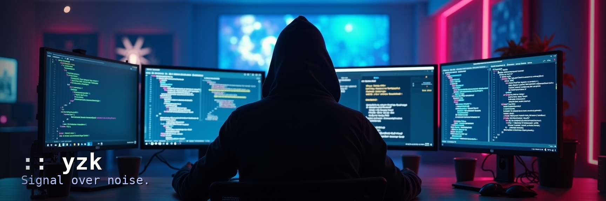

  

---

I build systems that reduce noise and reward clarity.  
Some run in the terminal. Some run in the browser. Some just run quietly.

I don't subscribe to one stack or one paradigm.  
Tools are chosen by intent, not allegiance.  
AI helps. So does silence.

If something feels wrong, I refactor it.  
If something feels right, I sharpen it.

---

## 🧰 Tech I Reach For

**Backends & APIs**  

**Frontend & Fullstack**  

**Dev Tools & Infra**  

Neovim for precision. Cursor for depth.

---

  
  
  

<em>:: yzk — signal over noise</em>

